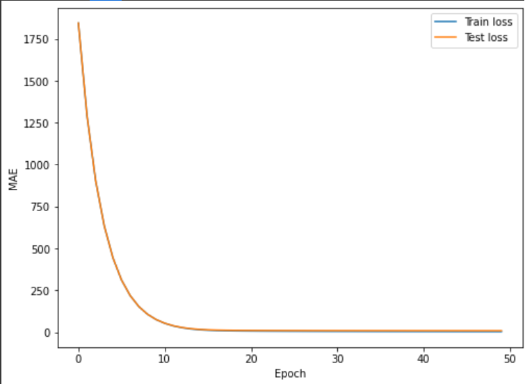
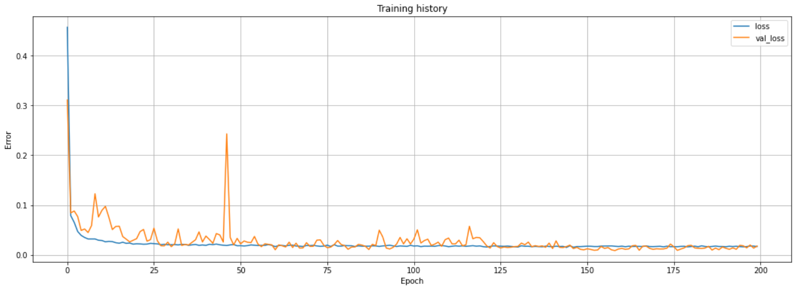
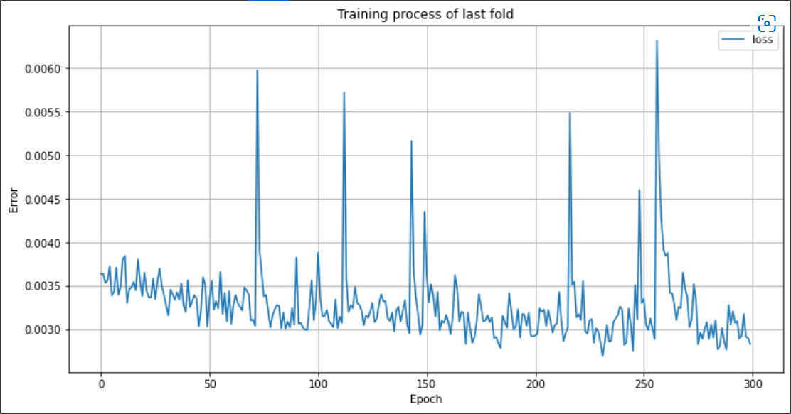
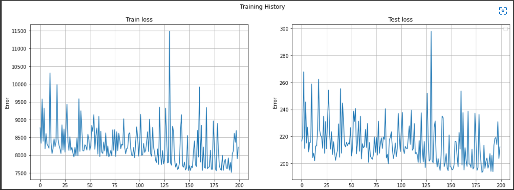

# Predicting Atomization Energies

## Introduction

### Machine learning for quantum chemistry

A crucial task in chemical compound design is to accurately predict molecular energetics. To circumvent computational cost, machine learning techniques are employed to speed-up the process while maintaining accuracy. The goal is to learn a map from a molecule to its atomization energy.

In the language of machine learning, each molecule is represented by an undirected simple graph, where each node (atom) having a *nuclear charge* feature and each edge is weighted by *distance between two nodes (atoms)*. Our target function is a map between each graph (molecule) to a value called *atomization energy*. Hence, a possible perspective is that we are dealing with graph-level regression task.

In this project, we will use `scikit-learn` and `pytorch-geometric` to investigate the performance of several machine learning algorithms in predicting the atomization energies of molecules.

### Molecular descriptor

We can either represent the data as a graph by a (weighted) adjacency matrix (as in the case of graph neural network), or simply flatten the nodes and the edges in the adjacency matrix of the molecular graph as our features for conventional machine learning methods.

A conventional way to represent molecules is to use Coulomb matrix
$C = [C_{ij}]_{1 \leq i, j \leq 23}$ [1], with the entries being:

$$
C_{ij} = \frac{Z_{i}Z_{j}}{|R_{i} - R_{j}|}, i \neq j; C_{ii} = 0.5Z_{i}^{2.4}.
$$

where $Z_{i}$ is the nuclear charge of atom $i$ and $R_{i}$ is its Cartesian coordinates. Informally speaking, diagonal entries of Coulomb matrix represents strength of nuclear charge of each atom in the molecule, and the off-diagonal entries describe the interaction between two atoms based on their nuclear charges (with sign) and their absolute distance.

**Limitations.** Although Coulomb matrix is invariant to translation and rotation of the molecule, it is *not invariant to permutation of atoms indices*. In addition, Coulomb matrices may have different sizes, but this is not a problem since in QM7 dataset we are only considering molecules with $23$ atoms. Lastly, molecular representation by Coulomb matrices alone misses many important features as a molecule lives in a continuous 3D space (e.g., Coulomb matrix misses angular information between atoms; consideration of rotational-invariance and equivariance).

## Pre-processing data

QM7 dataset of $7165$ molecules mainly consists of four components:

1.  A set $Z$ of atomic charge for each atoms in a molecule (dim.
    $7165 \times 23$)

2.  A set $R$ of Cartesian coordinate of each atom in the molecules (dim.
    $7165 \times 23 \times 3$)

3.  A set $X$ of Coulomb matrices for each molecule (dim.
    $7165 \times 23 \times 23$)

4.  A set $T$ of real-valued label of atomization energy for each molecule
    (dim. $7165$)

We mainly work with $X$ and $T$ in this project. With the discussed limitations of Coulomb matrix, we would like to pre-process the data to (hopefully) eliminate those issues.

### Unequal matrix sizes

Since each molecule has different number of atoms, their true Coulomb matrices have different sizes. In QM7 dataset, this issue is resolved by padding the Coulomb matrix with unconnected atoms, such that the sizes of all Coulomb matrices are $23 \times 23$.

### Arbitrary permutation of atoms

**(Dimensionality reduction by) eigenvalues/eigenvectors.** An approach is to compute the eigenvectors and the eigenvalues of the Coulomb matrix and use them as training data. However, this approach may cause us to lose some information [1]. We decide not to follow this approach.

**Sorting Coulomb matrix.** Since the ordering of atoms in the Coulomb matrix can be arbitrary, we would like to impose a specific row order on Coulomb matrices. One way to achieve this is to pick the permutation of atoms in Coulomb matrix $C$ such that

$$
||C_{i}|| \leq ||C_{i+1}||
$$

with $C_{i}$ being the $i^{th}$ row of $C$. Note that two different molecules have necessarily different associated sorted Coulomb matrices [1, Section 2.2].

**Using permutation invariant/equivariant algorithms.** Another method is to use permutation invariant or equivariant algorithms. Formal
definitions of invariance and equivariance are given in [2, Def. 5 and 6]. For example, graph filters embedding [3, Proposition 1] and graph neural network (GNN) [3, Proposition 2] are permutation equivariant without pooling layer, and permutation invariant with pooling layer. With graph filters and graph neural networks, we can ensure that the embedding of a molecule can be equivalent up to permutations. More generally, [4] discuss invariant/equivariant GNNs with general linear layer (instead of traditional polynomial graph filter).

### Feature engineering: graph topology

The Coulomb matrix can be seen of as a form of weighted adjacency matrix of a molecular graph of atoms. By only considering the individual
entries of the Coulomb matrix (e.g., by flattening the Coulomb matrix into a feature vector), we may not be able to capture the graph topology in the learning process.

**Eigenvalues and Eigenvectors.** One approach to incorporate graph-topology feature is to consider adding eigenvalues and
eigenvectors of the Coulomb matrix as a feature. We recall that eigenvalues and eigenvectors of an adjacency matrix can capture
community structure of a graph, a fact that is leveraged in spectral clustering [5]. On a side note, due to Spectral Theorem, the
(weighted) adjacency matrix has a full real-valued eigenbasis.

**Eigen-centralities.** Another information regarding graph topology we can include into training is centralities [6, Chapter 7] of each node. For example, we can include eigen-centrality into the feature vector.

**Other features.** There are other measures w.r.t. a graph that we can use for feature engineering. Generally, the main types of hand-crafted features are: node-level features (degree, motif counts, clustering coefficient, etc.), graph-level features (graph kernels such as graphlet kernels, Weisfeiler-Lehman kernel [7], etc.) and link-level features (shortest-path distances, local neighborhood overlap, Katz index, etc.). For a review of graph features, see [6, Chapter 7].

**Results.** In our experiments, we simply concatenate the eigenvalues/eigenvectors and the eigencentralities with the flatten
Coulomb matrix to obtain a dataset of $7165$ examples with $1104$ features instead of $23 \times 23 = 529$ features. The results are
however worse when we include the new features. This might be due to two reasons: (1) the naive concatenation of new features into old features (resulting in a \"heterogenerous\" feature vector); (2) introducing more features actually increases noise in the dataset as the machine learning methods employed may not be able to deduce meaningful patterns from those newly crafted features. We therefore only report numerical results without any further feature engineering.

### Extra: Data augmentation

To resolve the problem of arbitrary permutation of atoms, [1] proposes the following procedure to generate random (and sorted) Coulomb matrices:

1.  Take a Coulomb matrix $C \in \mathbb{R}^{d \times d}$ and compute the row norms $(||C_{1}||, ..., ||C_{d}||)$

2.  Draw $n \sim N(0, \sigma I)$ and find the permutation $P$ that sorts $C$ according to the new row norms $(||C_{1}||+n, ..., ||C_{d}||+n)$

3.  Permute the rows and columns according to $P$

In this way, two rows with roughly the same row norm can swap their positions; but two rows with vastly different row norm would not be as
likely to swap positions. Hence, this data augmentation procedure further accounts for possible noise in the dataset for two rows with
similar row norms. We will include this data augmentation procedure in future works.

## Experiments on QM7 Dataset

In this section, we report the performance on QM7 dataset of $6$ different methods (with an extra experiment on graph neural network).
The detailed data pre-processing procedure for each method is described in the corresponding subsection below.

### Linear Regression

We perform experiment on Linear Regression with `scikit-learn` library. The Coulomb matrices are sorted by row norms and then flatten, and the labels are rescaled. We perform 5-fold cross-validation, and obtain the minimum cross-validation loss of $17.9$ kcal/mol. The cross-validation is completed in $0.62$ seconds.

### Kernel Ridge Regression

We perform experiment on Kernel Ridge Regression with `scikit-learn` library. The Coulomb matrices are sorted by row norms and then flatten, and the labels are rescaled We perform 5-fold cross-validation, and obtain the minimum cross-validation loss of $4.70$ kcal/mol. The cross-validation is completed in $11.8$ seconds.

### Support Vector Regression

We perform experiment on Support Vector Regression with `scikit-learn` library. The Coulomb matrices are sorted by row norms and then flatten, and the labels are rescaled. We perform 5-fold cross-validation, and obtain the minimum cross-validation loss of $6.5$ kcal/mol. The cross-validation is completed in $63.6$ seconds.

### XGBoost (Gradient Boosted Trees)

We perform experiment on Gradient Boosted Trees with `XGBoost` library. The Coulomb matrices are sorted by row norms and then flatten, and the labels are rescaled. We perform 5-fold cross-validation, and obtain the minimum cross-validation loss of $8.78$ kcal/mol. The cross-validation is completed in $40.649$ seconds.

### Neural Networks

#### Vanilla Neural Network

We first attempt to learn the atomization energies by a vanilla neural network (i.e. multi-layer perceptron). The Coulomb matrices are sorted by row norms and then flatten, and the labels are rescaled. We construct a six-layer neural network with `he_normal` initializer, batch normalization and ReLU activation (except for output layer). We train the neural network with 200 epochs, mean absolute error as loss function and Adam optimizer. The neural network takes $2.39$ minutes to train, and obtain the minimum 5-fold cross-validation loss of $19.1$ kcal/mol.

The performance of vanilla neural network is significantly worse than the previous conventional non-linear methods since neural networks often require a very large dataset to work well, while QM7 only consists of $7165$ data points, which are relatively of small size.

#### Convolutional Neural Network with Binarization

Instead of vanilla neural network, we now construct a convolutional neural network in order to (hopefully) capture the relationship between multiple atoms (i.e. graph structure), instead of only considering a flatten feature vector. In this way, we hope to enrich the features that the models can learn.

Furthermore, following [1, Section 3.2], we convert the real-valued entries $c$ of Coulomb matrix to a \"binarized\" vector
$\hat{\mathbf{c}}$:

$$
\hat{\mathbf{c}} = \left[..., tanh\left(\frac{c-\theta}{\theta}\right), tanh\left(\frac{c}{\theta}\right), tanh\left(\frac{c+\theta}{\theta}\right), ...\right]
$$

In this way, the data representation in Coulomb matrices are more flexible, (hopefully) enabling a better performance for neural network.

In this experiment, we use a six-layer convolutional neural network. The input labels are rescaled, and the input Coulomb matrices are enlarged with the above binarization scheme (with $\theta=1$ and the width of $11$). The details of the model configuration are available in the attached file `atomization_energies_prediction.ipynb`. The training process takes $26.8$ minutes, and we achieve the minimum cross-validation loss of $9.5$ kcal/mol.

### Extra: Graph Neural Network

We perform an extra experiment with Graph Neural Network (GNN) model, specifically Graph Convolutional Network (GCN) [8].
Recently, GNN models achieve great empirical results on many benchmark graph datasets. This empirical successes are driven by the ability of GNN to capture graph structure in its embedding, as well as the permutation-equivariant property, which makes GNN superior to other neural network models in graph-related tasks.

In this experiment, we use an implementation of `GCNConv` layer provided in PyTorch Geometric to define our own GCN model. The model consists of three `GCNConv` layer with a readout linear layer. We train the model for $200$ epochs on a subset of $7000$ data points from the original QM7 dataset. Finally, we test the performance of the model on the test set of $165$ data points. The implementation is provided in the attached file `gnn_qm7.ipynb`.

Due to lack of computing resources, we are not able to fine-tune our GNN model, therefore the performance of the GNN model is much worse than previous models, achieving a final test loss of $193.376$ kcal/mol. However, with both theoretical and empirical evidence supporting GNN models in the literature, we believe that with proper implementation and sufficiently large dataset, GNN models can compete with conventional methods.

## Discussion

| No. | Method | Cross-validation Loss (kcal/mol) | Running Time (sec) |
| --- | --- | --- | --- |
| 1 | Linear Regression | 17.9 | 0.62 |
| 2 | Kernel Ridge Regression | 4.70 | 11.8 |
| 3 | Support Vector Regression | 6.50 | 63.6 |
| 4 | XGBoost | 8.78 | 40.65 |
| 5 | Vanilla NN | 19.1 | 143.5 |
| 6 | CNN with Binarization | 9.25 | 1610.5 |

For a small dataset like QM7, we can see that sophisticated methods like neural network and graph neural network may not perform well since these methods often require a large amount of data. Instead, simple non-linear methods like kernel ridge regression, support vector regression and gradient boosted decision trees are more efficient in execution time and also achieve a much better accuracy.

We also observe that data pre-processing plays a very important role in performance of the learning algorithms, especially data rescaling/normalization. For the issue of arbitrary permutations regarding Coulomb matrix, besides the naive method relying on fixing a row order based on their norms, we can further account for the noise by generating randomly sorted Coulomb matrix, which can enable us to achieve an even better results [1].

## Appendix

1.  Link to main experiments on Google Colab: [`atomization_energies_prediction.ipynb`](https://colab.research.google.com/drive/1ueCRkG1RuTgizpcGQIoZuih__RLANV8S?usp=sharing)

2.  Link to extra experiment (graph neural network) on Google Colab: [`gnn_qm7.ipynb`](https://colab.research.google.com/drive/1GcIwjTfvigVL3o0jE4YgsE_bMnJcIh9t?usp=sharing)

## References

[1] Grégoire Montavon et al. “Learning Invariant Representations of Molecules for Atomization Energy Prediction”. In: Advances in Neural Information Processing Systems. 2012.

[2] Ryoma Sato. A Survey on The Expressive Power of Graph Neural Networks. 2020.

[3] Fernando Gama, Joan Bruna, and Alejandro Ribeiro. “Stability Properties of Graph Neural Networks”. In: IEEE Transactions on Signal Processing (2020).

[4] Haggai Maron et al. “Invariant and Equivariant Graph Networks”. In: International Conference on Learning Representations. 2019.

[5] Ulrike von Luxburg. “A tutorial on spectral clustering”. In: Statistics and Computing (2007).

[6] M. Newman. Networks. OUP Oxford, 2018. ISBN: 9780192527493.

[7] Nino Shervashidze et al. “Weisfeiler-Lehman Graph Kernels”. In: Journal of Machine Learning Research (2011).

[8] Thomas N. Kipf and Max Welling. “Semi-Supervised Classification with Graph Convolutional Networks”. In: International Conference on Learning Representations (ICLR). 2017.
